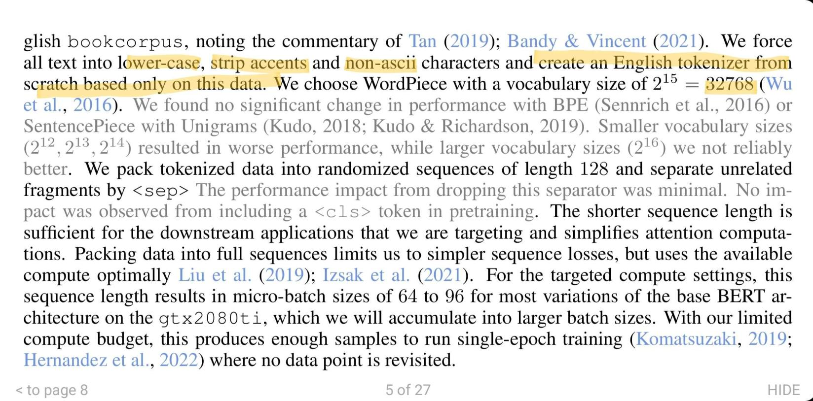

https://arxiv.org/pdf/2212.14034.pdf

## 4.4 OPTIMIZING THE DATASET
We found that scaling laws create a barrier to making major gains (beyond computational efficiencies) with architectural modifications. However, __scaling laws do not preclude us from training on better data__. Once we have exhausted our ability to train on more tokens per second, we should seek to __train on better tokens__.

We consider two data based pathways to better down-scaling:
- First, we can filter, process, or sort the existing data in various ways.
- Second, we can swap our data source.

From these Pile datasets we tokenize the first 4 × 10^6 entries to generate enough tokens for our single pass. Another popular source of data is C4, the colossal, cleaned version of Common Crawl (Raffel et al., 2020), from which we stream the first 20 × 10^6 entries. For each data source we regenerate its own WordPiece tokenizer as described in Section 4.1.

Of these four sources, we find the Pile to perform best in terms of downstream MNLI performance. However, it turns out we can further improve especially the C4 datset through additional processing:

- We first evaluate deduplication as described in Lee et al. (2022) via exact substring deduplication, but find this not to help in downstream performance in our case.

- We then test filtering for uncompressible data. We use the tokenizer itself to remove all training sequences from C4 set that cannot be compressed well; we simply set a threshold t, e.g. t = 0.3, and drop all entries from the dataset __where the number of tokens in the entry is larger than t times the number of raw characters__. This removes, for example, sequences consisting of hard-to-compress HTML or markdown code. Surprisingly, this results in a measurable improvement on C4, summarized in Table 2.

=> _Nén ở đây có nghĩa là hàm lượng thông tin nhiều (nhiễu loạn), tknz không làm giảm được độ dài dữ liệu._

We then see some further improvements from two directions:
- First, sorting all tokenized sequences by some metric, and 
- Second, increasing the final batch size.

For filtering we sort all tokenized sequences by their average (unigram) token prevalence (đang lưu hành), so that likely sequences occur first. This has some positive effect, and can be strengthened slightly by drawing from a larger corpus, as the unlikely sequences never get reached.

Finally, increasing the batch size to 4032/4096 at the end of training (as mentioned in Section 4.3) is disproportionally effective on C4, but less so on bookcorpus-wikipedia. We believe that both modifications __ultimately reduce the likelihood of training being hindered by fluctuations in the data distribution__.

=> _Tăng batch-size giống như 1 cách fine-tune!_

### Vocabulary Size

Increasing the vocabulary size would __compress data further__ (albeit vanishingly after some point), which would allow for more information to be compressed into the fixed number of tokens that can be ingested during the crammed training run. In Figure 3, we find that for bookcorpus-wikipedia data, larger vocabulary sizes correlate with larger average GLUE score, although the effect is plateauing for the MNLI task around the original 32768 vocabulary size. Moving forward, we hence keep this vocabulary size.

=> _Vấn đề là làm sao để compress đc nhiều data hơn!_

- - -

Để huấn luyện tknz, với TA, họ chuyển text sang dạng viết thường và loại bỏ các ký tự không phải ASCII. Với họ vocab_size = 2^15 là tối ưu. Sau đó họ đóng gói dữ liệu đã được tknz một cách ngẫu nhiên có độ dài 128 (??) và phân biệt với nhau bởi token `<sep>` Giới hạn độ dài quyết định bở downstream tasks. Họ chọn seq len ngắn bởi nó không ảnh hưởng tới perf của downstream tasks và để tiết kiệm tính toán cho cơ chế attn. micro-batch sizes họ chọn là 64 hoặc 96 và bước huấn luyện cuối họ dồn vào 1 batch size lớn (vài nghìn).

Việc sử dụng bản thân tknz để loại bỏ dữ liệu "xấu" có vẻ hấp dẫn. Vì tknz quyết định tỉ lệ nén của câu đầu vào, nếu câu đầu vào tận dụng được tknz thì đó là câu "tốt" :)

Sau đó họ cải tiến bằng cách sắp xếp tokenized seqs theo 1 thứ tự ưu tiên nhất định (huấn luyện tokens tốt trước). Và ở lần huấn luyện cuối họ tăng batch size lên 4032 hoặc 4096 để làm giảm sự phân bố không đều của dữ liệu (??)

=> Cần kiểm tra code để xem cách họ thược hiện củ thể từng tricks https://github.com/JonasGeiping/cramming/tree/main/cramming/data

- - -

https://github.com/JonasGeiping/cramming/blob/main/cramming/data/curriculum_sorting.py
- sắp xếp dataset theo unigram dist